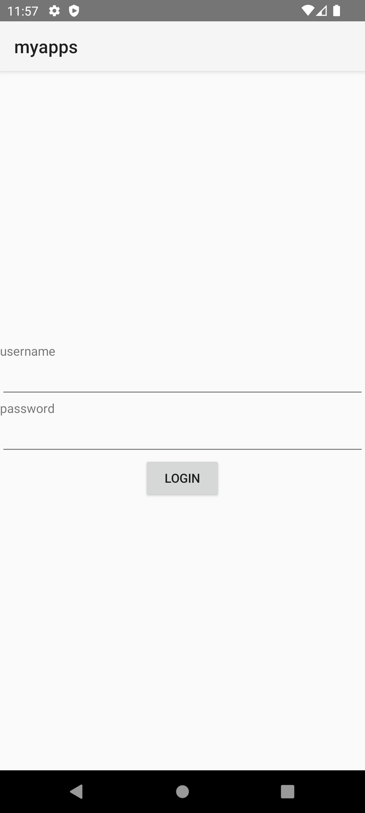
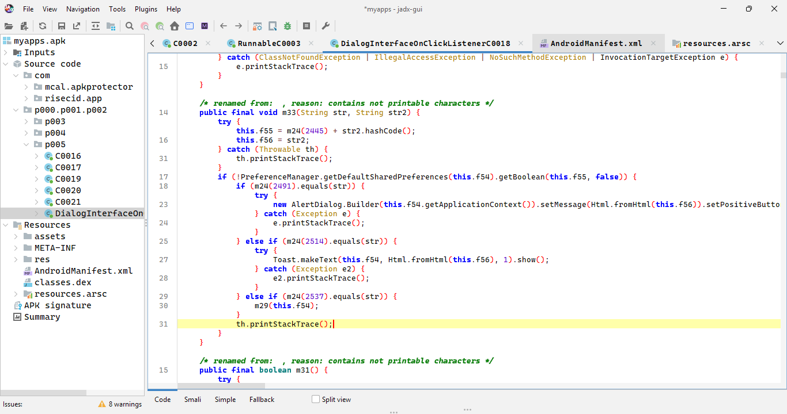
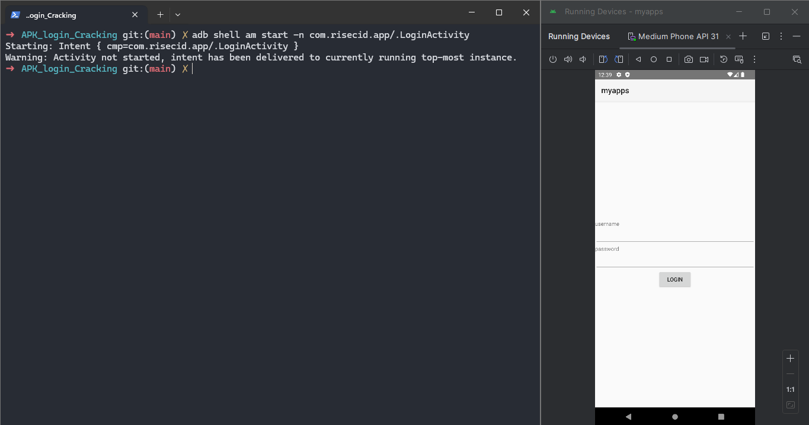
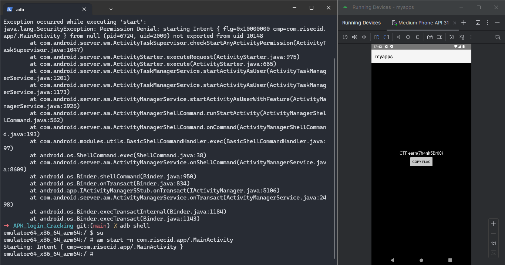

# APK Login Cracking

## Question
Please help me crack the login and gain access to the main app. Good luck!

## Solution
- Trong lần này ta phải xử lý file `apk`.
- Mình dùng giả lập android của `Android Studio`

- Từ đây mình đang có hai hướng: 
	- Tìm ra `username` và `password`.
	- Bypass trực tiếp để lấy flag.
1. Tìm `username` và `password`.
- Mình sử dụng `jadx-gui` để mổ file `apk` ra cho dễ đọc source code: 

- Mình thấy hàm `m33` này khá khả nghi vì nó nhận 2 biến kiểu `String`
- Thử tìm kiếm `m24(2491)`, `m24(2514)`, `m24(2537)` và `m24(2445)`
```
➜  APK_login_Cracking  python Test.py
DIALOG
TOAST
NOTIFICATION
__welcome_message_shown_
```
- Và mình nhận được các giá trị này, cảm thấy đã sai nên mình đọc lại code trước khi tìm `str2` thì thấy chắc chắn không thể tìm thấy `username` && `password` trong các source code.
2. Bypass
- Mình mở file `AndroidManifest.xml` để tìm tên `class`, nhận thấy `.LoginActivity` khá khả nghi nên mình sẽ thử chạy nó bằng `adb` xem có thể bypass được gì không

- Vẫn không nhận được gì cả, chỉ là màn hình login
- Tiếp tục thử class `.MainActivity` vì nó cũng là một gợi ý của đầu bài

- Done!!!, chúng ta đã tìm thấy flag: 
```
CTFlearn{7h4nk5Br00}
```