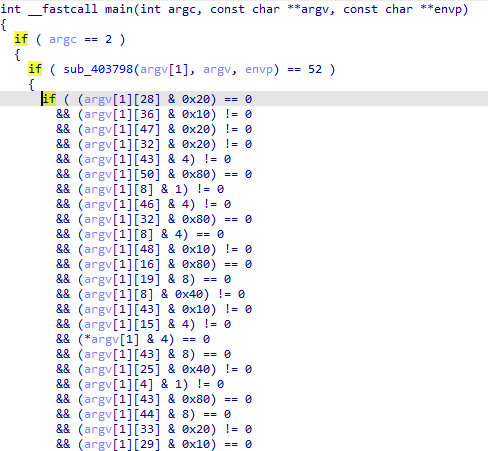

# Every Bit Counts
## Question

My colleague is a senior C developer and he had a bad experience in his job assignment. He was developing applications for a real-time embedded operating system named "Buggy OS™". He had to implement workarounds to avoid using the standard C library in some cases. For instance the `memcmp` shouldn't be used to test command-line argument because of obscure reason resulting in some bits were not checked. Instead he implemented its own function to check each bit of the command-line and it was working fine.

To show case how painful it was, he showed me one of its application implementing his new function, but he forgot the supported command-line parameter.

Note: Solution with cool effects shared in comment.

## Solution
- Mở file bằng `IDA` ta thấy đoạn code chỉ xử lý `password` bằng hàm một câu lệnh `If` duy nhất, đoạn code khá dài nhưng mình cắt một đoạn trong ảnh dưới:

- Câu lệnh lấy ngẫu nhiên các ký tự của `password` thực hiện phép `&` với các giá trị `0x20`, `0x10`, `0x80`, `0x40`,... 
- Ta sẽ viết script để thực hiện `Brute forces` (Code này mình tham khảo Wu của **ebouteillon**
```
#/usr/bin/env python3

import sys

pwd = bytearray('-' * 52, 'utf8')

with open('921', 'rb') as f:
    f.seek(0x486)
    while True:
        code = f.read(11)
        if code != b'\x48\x8b\x45\xf0\x48\x83\xc0\x08\x48\x8b\x08':
            break
        code = f.read(3)
        if code == b'\x48\x83\xc1':
            offset = int.from_bytes(f.read(1), 'big')
            code = f.read(3)
        else:
            offset = 0
        code = f.read(3)
        mask = code[2]
        if mask == 0x80:
            f.read(3)
        code = f.read(9)
        if code[4] == 0x85:
            pwd[offset] &= ~mask
        else:
            pwd[offset] |= mask

        print(pwd.decode('utf8'), end='\r')
        sys.stdout.flush()
print()

```
- Phải nhớ file `Solved_2.py` và file `921` phải ở trong cùng thư mục thì script mới tìm thấy và hoạt động nhé.
- Và mình nhận được `Flag` sau khi run code:
```
➜  Every_bit_count: python Solved_2.py
CTFlearn{w0w_you_f0und_My_fl@g_y0u_Ar3_so_much_n1c3}
```

**Để hiểu rõ các câu lệnh và cách hoạt động thì mình có note đầy đủ trong file `Solved_2.py`**